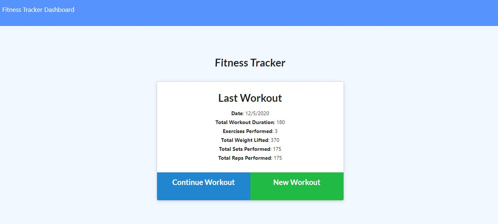

# Stayfit-tracker

## Description

Track your workouts with Stayfit Tracker. The app will keep track of every exercise in your workout. The app dashboard will display weekly summary graphs of all workouts done in a week.

## Table of Contents

* [Installation](#installation)
* [Usage](#usage)
    * [Screenshots](#screenshots)
    * [Snippets](#snippets)
    * [Technologies](#Technologies)


## Installation

1. Clone repository. 
2. Check in routes/api-routes and comment in block of code if you want the database to be prepopulated with dummy values.
3. npm install (Running seeders/seed.js is optional to have a prepopulated database).
4. node server.js

* [See Heroku Live Site](https://glacial-coast-30043.herokuapp.com/)

## Usage

### Screeshots

Homepage displaying last workout




### Snippets


1. Adding to an array type

```javascript

    router.put("/api/workouts/:id", function ({ body, params }, res) {
    Workout.findByIdAndUpdate(
    params.id,
    { $push: { exercises: body } },
    // "runValidators" will ensure new exercises meet our schema requirements
    { new: true, runValidators: true }
  )
    .then(function (dbWorkouts) {
      console.log(dbWorkouts);
      res.json(dbWorkouts);
    })
    .catch(err => {
      res.json(err);
    });
});
    
```
* This function will add an exercise to the array of exercises that belong to the workout with the given id. Here we will locate the workout with the given ID and update its fields. We will increase the total duration of the workout by the duration of the exercise being inserted. We will push the exercise to the array of exercises.


### Technologies used

* [HTML](https://developer.mozilla.org/en-US/docs/Web/HTML)
* [CSS](https://developer.mozilla.org/en-US/docs/Web/CSS)
* [Bootstrap](https://getbootstrap.com/)
* [Javascript](https://www.javascript.com/)
* [Node.js](https://nodejs.org/en/)
* [Express](https://www.npmjs.com/package/express)
* [MongoDB](https://www.mongodb.com/)

